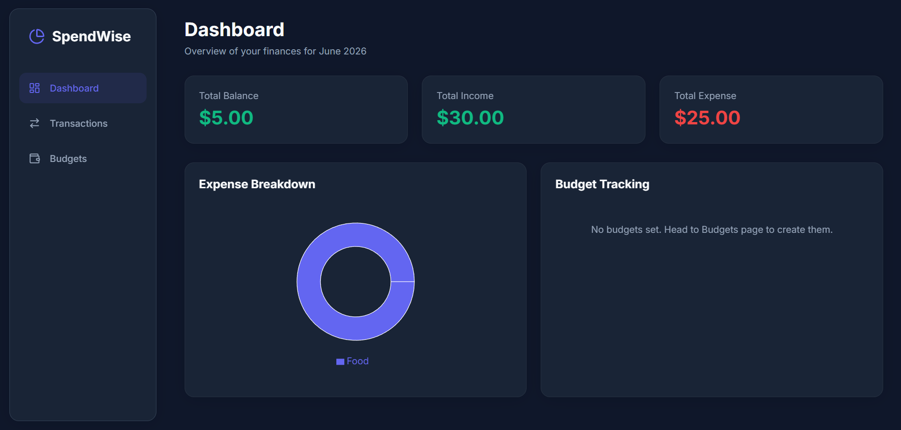
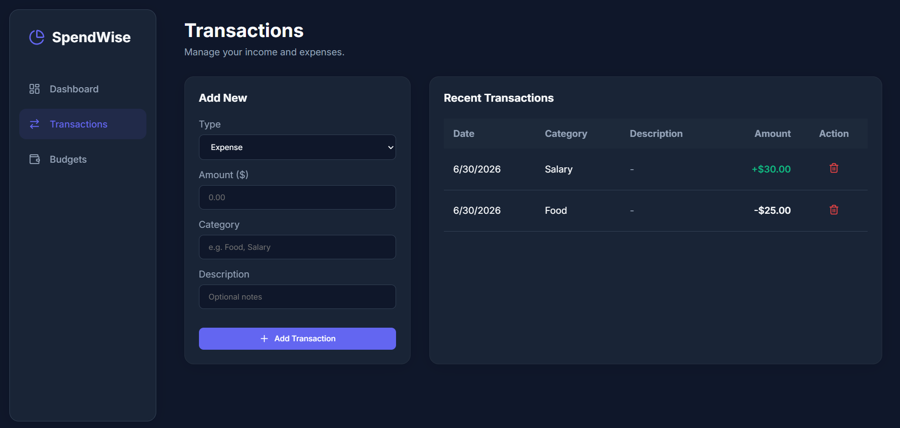
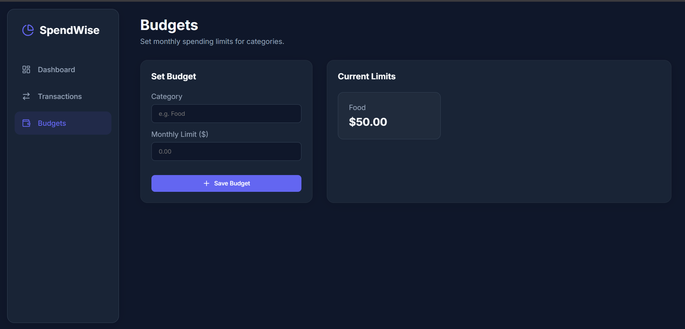

# SpendWise | Full-Stack Expense Tracker

SpendWise is a full-stack expense tracking application designed to help users manage their finances effectively. It features a React.js frontend, a Node.js/Express.js backend, and uses MongoDB for persistent storage of categorized transactions.

## Features

- **Full-Stack Architecture**: React.js frontend integrated with a Node.js/Express.js backend.
- **RESTful API**: Designed endpoints for expense CRUD operations, category management, and monthly summaries.
- **Interactive Dashboard**:
  - Total Balance, Income, and Expense cards.
  - Category-wise breakdown utilizing a donut chart.
  - Budget threshold tracking with visual progress bars.
- **Transactions Management**: Add, view, and delete categorized transactions.
- **Budgeting**: Set monthly spending limits per category.
- **Premium UI**: Sleek dark mode design with glassmorphic elements and modern aesthetics.

## Technology Stack

- **Frontend**: React.js, Vite, React Router, Recharts, Axios, Lucide React
- **Backend**: Node.js, Express.js
- **Database**: MongoDB (using Mongoose ODM)

## How to Run Locally

This project uses an in-memory MongoDB instance for seamless local testing. You do not need to install MongoDB locally.

### 1. Start the Backend Server

```bash
cd backend
npm install
npm start
```
The backend server will run on `http://localhost:5000`.

### 2. Start the Frontend Development Server

Open a new terminal window:

```bash
cd frontend
npm install
npm run dev
```
The frontend will run on `http://localhost:5173` (or similar port provided by Vite).

## Screenshots

### 1. Dashboard View


### 2. Transactions Management


### 3. Budget Planning


